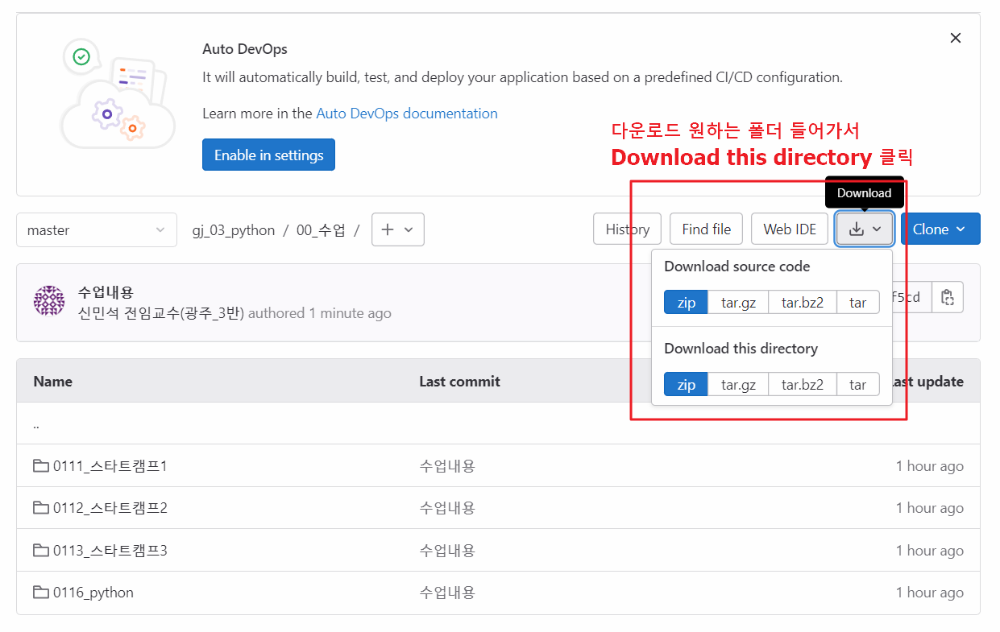

# 광주3반 gitlab 사용 방법

[9기 공식 문서(노션) 링크](https://hyper-growth.notion.site/SSAFY-Public-Document-9dc94ea8a050472ca00ffe8ea58586da)

### 처음 세팅 : 저장소 복제

```
git clone https://lab.ssafy.com/s09/c03/gj_03_python.git
```

### 이후 사용
업데이트 할때마다 아래 명령어로 최신화
(땡겨오기)
```
git pull origin master
```

## 저는 일부만 받아서 쓰고싶어요 : 아래 참고
### 이 기능은 git 사용 없이 다운로드만 받음


### 주의사항

1. 반 저장소(레포지토리)에 직접 수정하여 commit, push 절대 금지
2. 필요시 개인 저장소 이용
   1. 여기 있는 파일을 복사해서 개인 저장소에 붙여넣기 (github x gitlab o)
   2. github는 파일 그대로 올리시지 말길 바랍니다.


